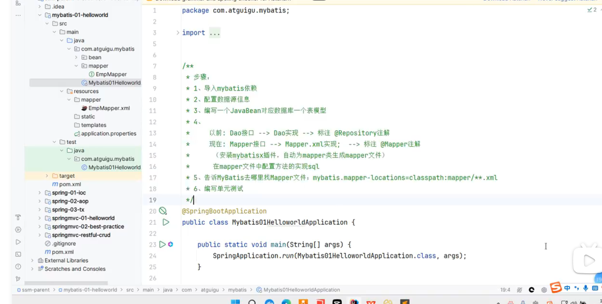
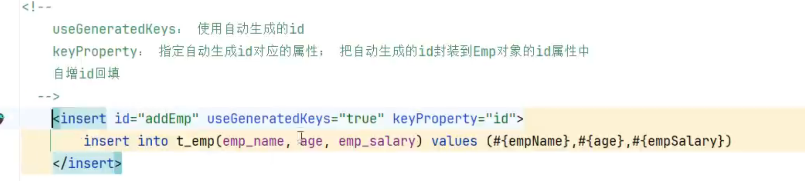

# mapper 代理开发


* 定义sql映射文件同名的mapper接口，并且将mapper接口 和sql映射文件放置同一目录

  （在resource 文件夹下面创建directory 时候 要用com/mybatis/mapper  才能形成package的..分层效果，要不然就只是一个文件）

  在resource 里面创建mapple接口的同名路径包,将usermapper.xml放进去,最后编译的时候,两个是在一起的.


* namespace 要对应上mapple 接口全限定类名

* 接口中方法名对应xml中语句sql id对应

  

  

  * ```
    <mapper namespace="com.mybatis.mapper.UserMapper">
        <select id="selectAll" resultType="com.mybatis.pojo.User">
            select * from tb_user;
        </select>
    ```

  * ```java
    List<User>selectAll();
    
    
    ```

* ```java
  UserMapper mapper = sqlSession.getMapper(UserMapper.class);
  List<User> users = mapper.selectAll();
  ```


用mapper开发和传统xml开发如以下

```java
InputStream inputStream = Resources.getResourceAsStream(resource);

SqlSessionFactory sqlSessionFactory = new SqlSessionFactoryBuilder().build(inputStream);

//获取stqlsession 对象,来执行sql语句

SqlSession sqlSession = sqlSessionFactory.openSession();

UserMapper mapper = sqlSession.getMapper(UserMapper.class);
List<User> users = mapper.selectAll();

List<User> users1 = sqlSession.getMapper(UserMapper.class).selectAll();

List<Object> objects = sqlSession.selectList("com.mybatis.mapper.UserMapper.selectAll");
```


# mybatis 核心配置文件

* 介绍mybatis.xml文件


```
    <typeAliases>
        <package name="com.mybatis.pojo"/>	包扫描 也可一个一个来配alias
    </typeAliases>
<!--    <environemnts> 配置数据库连接环境信息 通过default来切换环境 -->
```


# 1

* 在sql语句和java方法传参时候区别		参数占位符
* #{}	会将其替换为？，防止sql语句注入 ，
  * ${}   	也可以实现传参效果，但存在注入问题


* 在sql中特需字符 	如where < #{id}  (因为不符合xml规则)
  * 1.转义字符处理 : &lt
  * 2.CDATA区: CD后idea提示


# 查询


*   多条件查询!!!!

* 当接口中有多个参数时候,使用注解@param 将每个参数对应上sql语句中的参数

  

  ```java
  List<Brand> selectByCondition(@Param("status")int status,@Param("companyName")String companyName)
  
  
  ```

  

  

  

* 接口方法传参时候还可以直接传一个对象,sql各个参数对应上对象中的每个参数

* 传参map也可以


* 模糊查询 like
  * 当用户传参来
  * int status=1;
  * string company="华为"
  * 应当如下处理参数
  * company = "%"+ company+"%"
  * sql语句用like 匹配


## 动态查询

* sql语句会随着用户的输入或外部条件的变化而变化,


``` xml
<select id ="selectByCondition" resultMap="brandResultMap">
	select * 
	from tb_brand
	<where> 
			<if test="status!=null">
			status=#{status}
			</if>
			
	后面一样 就是用if标签 来选择判断 还有choose1等其他标签  </where>
```


## 单条件的动态查询


``` 
<select id="~" resultMap="~">
select * 
from ~
where  (可以是标签也可以是语句)
<choose> 
	<when test="status!=null"> 
	status=#{status}
	</when>
	
	~~~
	</choose>
```


​		

## 插入数据

* 插入数据,但未添加到数据库,是因为开启了事务,自己手动添加语句提交,或者将事务关闭
* 插入数据,添加到数据库,但是查不到主键, 
  * 要在sql语句后 加usegenerate="true",keyproperty="id"  (指向主键的名称)


## 


## 多参 @ param 底层实现


底层会用map把传过来的参装进来




